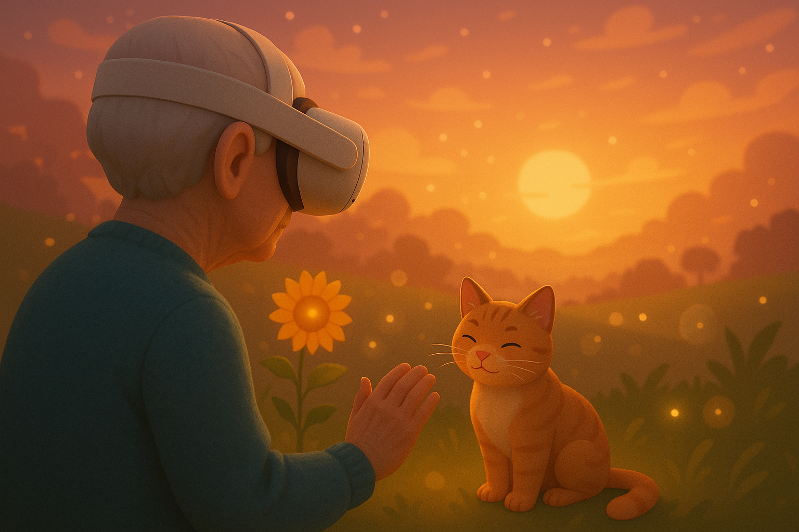
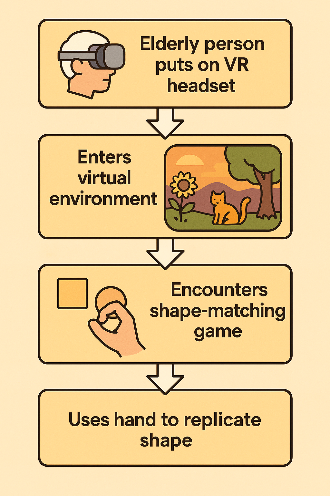

# 🌿 Serious Game – VR Nature & Cognitive Therapy for Elderly

## Note Taking

### What is a Serious Game?

A **serious game** is a game designed for purposes beyond pure entertainment. It integrates elements of gameplay with real world applications such as education, healthcare, training, or research. These games are interactive experiences that aim to **educate, inspire, or facilitate behavioral and cognitive development** while maintaining an engaging format. By leveraging the immersion and motivation that games provide, serious games can help users absorb information or undergo therapy in a more natural and enjoyable way.

---

### What Are We Working On?

We are developing a **virtual reality (VR) game experience** tailored for individuals with **dementia** or **elderly people with limited physical mobility**. The goal is to offer a **soothing, immersive connection with nature** something many users may no longer have access to in real life.

This VR game aims to:

- Provide **therapeutic exposure to nature** using virtual environments like forests.
- Stimulate **cognitive functions** through simple and intuitive interaction based mini games.
- Offer a sense of **relaxation, memory stimulation, and physical engagement** via hand gestures.

---

### How Does the Game Work?

The experience begins when the player puts on a **Meta Quest 2 VR headset** and is transported into a **peaceful forest environment**.

As they enter the virtual world, the player is welcomed by:
- A **friendly cat companion** that appears at the start.
- **Calm and soothing background music** to promote relaxation.
- A scenic environment featuring **glowing sunflowers** and a beautiful **sunset sky**, designed to bring joy and a sense of wonder.

The game is designed to be **flexible**:
- It's **not mandatory** for the person to engage in active gameplay.
- If the user simply wants to enjoy the **peaceful jungle environment** with the cat, they can do that.
- The **cat companion** provides comfort and interaction—if the player touches the cat, it reacts with **cute, friendly sounds** to increase emotional connection.

When the player is interested in interacting, they can participate in **simple mini-games**:
- One such game is a **shape-matching activity**.
- The game displays a shape (e.g., circle, square) in front of the player.
- The player uses **hand gestures** to replicate the shape.
  - For example, when a **circle** appears, the player forms a **fist** to match it.
  - Shapes may be rotated, requiring the use of:
    - Left or right hand
    - Upside-down or side rotations
- The game gives **real-time feedback** and plays **pleasant music or sounds** when the shape is matched correctly, reinforcing a sense of success and joy.

**Reference video inspiration**:  
[https://x.com/interesting_aIl/status/1915692973808902605?t=c6V2oNFM48PXrv5aK7XsFA&s=08](https://x.com/interesting_aIl/status/1915692973808902605?t=c6V2oNFM48PXrv5aK7XsFA&s=08)

---

---

**Reference video inspiration**:  
[https://x.com/interesting_aIl/status/1915692973808902605?t=c6V2oNFM48PXrv5aK7XsFA&s=08](https://x.com/interesting_aIl/status/1915692973808902605?t=c6V2oNFM48PXrv5aK7XsFA&s=08)

---

###  Tools & Technologies Used

We are utilizing the following tools to bring this project to life:

- **Unity** – Game engine for developing immersive VR experiences.
- **Blender** – 3D modeling and animation software for creating forest assets and game objects.
- **Meta Quest 2** – VR headset used for testing and deploying the game, with hand-tracking capabilities.

---
